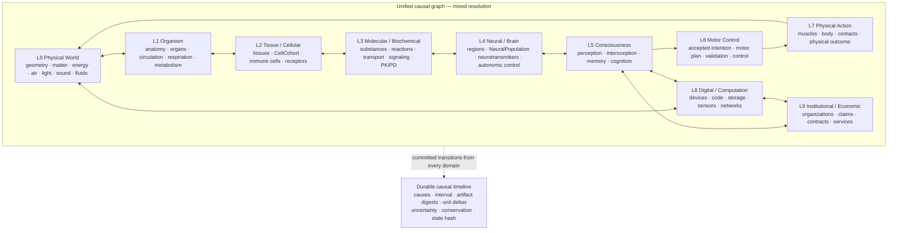

# MakiseWE

Персистентная многомасштабная причинная симуляция мира, организмов и отдельных сознаний.

[](https://github.com/Khalwaia/MakiseWE/actions/workflows/ci.yml)
[](https://spdx.org/licenses/AGPL-3.0-only.html)
[](rust-toolchain.toml)

> Проект находится на архитектурной стадии. Текущий исполнимый World Engine — проверяемое legacy-compatible ядро; целевая биология V1 ещё не реализована.

## Что такое MakiseWE

MakiseWE строит непрерывный виртуальный мир, где физические, биологические, когнитивные, цифровые и institutional последствия возникают из версионированных причинных механизмов. LLM участвует в осмыслении и планировании, но не назначает состояние тела, программы, организации или успешность действий.

Главная цель V1 — расширяемая симуляция полной жизни: от среды и повседневной физиологии до болезней, репродукции, развития, старения, нейробиологии и нескольких сознаний. Начальное разрешение задаёт рабочую точку, а не предел fidelity.

MakiseWE — самостоятельный проект. Он не импортирует runtime, память, сессии или личную историю других цифровых систем.

## Архитектурные принципы

- World Engine — единственный автор authoritative physical, biological, neural, digital и institutional state.
- `WorldEngine::commit` — единственный mutation path для времени, stimuli, model responses, actions, resolution changes и admin intents.
- Каждый механизм публикует полный `MechanismContract`: causal ports, read/write sets, units, provenance, uncertainty, validity range, conservation, failure policy и validation evidence.
- Каждый способ представления публикует `ResolutionContract`: lift, projection, conserved quantities, observable continuity, lineage, compute estimate и rollback.
- Human и Neko — независимые root `MorphotypeDefinition`, подключающие общие mechanisms через package data. Runtime не содержит morphotype-specific branches.
- `CellCohort` и `NeuralPopulation` — V1 adapters. Более детальные представления реализуют те же causal contracts.
- Simulation — единый causal graph с обратными связями и mixed resolution, а не последовательный pipeline или набор независимых engines.
- Durable causal timeline записывает transitions всех causal domains; `WORLD EVENTS` не является отдельным simulation layer.
- Resolution меняется только через explicit causally triggered `ResolutionChanged` с deterministic trigger, conservation proof и error bounds.
- LLM создаёт `CortexProposal`. `CognitiveGate` записывает `CognitiveDisposition`; только `Accepted` разрешает отдельную transition принятия goal или intention.
- Accepted intention запускает durable closed-loop `ControlEpisode`, но не содержит promised outcome; semantic функции `cook`, `build` или `install` не мутируют финальное состояние.
- Устройства и приложения принадлежат causal world: код фактически исполняется в deterministic sandbox, а доступ к sensors, network и physical devices проходит через scoped capabilities.
- Organizations не являются сознаниями; contracts создают obligations, designs описывают намерение, а услуги и строительство исполняются через реальные digital, institutional и physical transitions.
- Production, acceleration, recovery и replay используют одинаковые canonical transitions. Wall clock меняет темп, но не causal semantics.
- Authoritative числа имеют units либо определённый dimensionless kind. Arbitrary normalized scores запрещены.
- Capacity конечна и измерима, но schema не ограничивает число organisms, cells, neurons или consciousnesses.

### Causal map

L0–L9 — области состояния и mechanisms, не шаги общего tick. Physical, biological, neural, cognitive, digital и institutional mechanisms взаимодействуют через stable causal ports; один organ, device или process может одновременно соседствовать с coarse и fine representations.



Дождь, открытие двери и падение объекта — committed transitions соответствующих mechanisms. Timeline наблюдает причинную историю поперёк graph; она не стоит «под» physics и не исполняет события вместо mechanisms.

Подробные решения закреплены в [ARCHITECTURE.md](ARCHITECTURE.md), [INVARIANTS.md](INVARIANTS.md) и [ADR](docs/adr).

## Текущий статус

Завершён **Phase 0 — contracts and architecture**:

- согласованы vision, architecture, world model, protocol, invariants и roadmap;
- определён ubiquitous language;
- добавлены JSON Schemas для mechanism, resolution, morphotype и cognition contracts;
- добавлены минимальные Human/Neko, cell/neural resolution и cognitive fixtures;
- schema tests проверяют validation, conservation, lineage, observable continuity, morphotype isolation и запрет прямой LLM mutation;
- заранее определён 24-часовой Human/Neko vertical scenario.

Завершён **Phase 1**: causal-kernel покрывает checked quantities, strict
`MechanismContract` admission, organism slices, durable transition stream через
`events()`, tamper detection и worker invariance; gate закрыт отдельным commit.

**Phase 2** — apartment and physical embodiment — завершён отдельным gate
commit: metric rigid bodies с точной консервацией, контакты с Coulomb
friction, physics islands с physical rest trigger, bipedal balance и durable
walk `ControlEpisode`, fluid statics и pour/spill учёт, room atmosphere с
measured теплоёмкостью воздуха и конвекцией через shared thermal port,
point-source звук/свет/запахи с declared затуханием, electricity/water сети,
cook/clean/dress `ControlEpisode`s и durable body records через
`WorldEngine::commit`. Сквозной `apartment-v2` acceptance scenario прошёл с
отрицательными тестами плана. Evidence — в
[docs/plans/0005-phase2-slice-status.md](docs/plans/0005-phase2-slice-status.md);
план зафиксирован в
[docs/plans/0003-phase2-apartment-embodiment.md](docs/plans/0003-phase2-apartment-embodiment.md).

## Что уже работает

Репозиторий содержит исполнимое legacy-compatible ядро, необходимое для безопасной миграции:

- Rust single-writer World Engine;
- append-only SQLite WAL event log, snapshots и deterministic replay;
- idempotent commands и optimistic world-version validation;
- bounded actor и gRPC/HTTP2 через Unix Domain Socket;
- Protobuf V1 contract и C++20 WorldClient;
- durable activities, downtime recovery и clock anomaly handling;
- data-defined world packages и schema validation;
- частичное восприятие без утечки скрытых object properties;
- weather observations и deterministic environmental projections;
- path guard, блокирующий доступ к защищённому внешнему runtime.
- новый V1 `makise-causal-kernel`: quantities, artifact admission, thermal proposal,
  идемпотентные commits и restart/replay persistence; Phase 2 физика — metric
  rigid bodies с exact conservation, contacts/friction, physics islands с rest
  trigger, balance и walk `ControlEpisode`, fluid statics и pour/spill учёт.

Этот код не является реализацией новой многомасштабной физиологии. Новая V1 получит отдельную timeline/DB и compatibility migration по [PROTO.md](PROTO.md).

## Целевой охват V1

Roadmap состоит из последовательных gates:

1. **Phase 0:** contracts, schemas, fixtures и architecture — завершён.
2. **Phase 1:** 24 часа Human/Neko; среда, минимальная физиология, сон, perception, scripted cortex и explicit `ResolutionChanged` — завершён.
3. **Phase 2:** метрическая квартира, материалы, articulated bodies, contacts, fluids, heat, air, light, sound, electricity и water — завершён.
4. **Phase 3:** everyday cardiovascular, respiratory, renal, digestive, endocrine, skin и musculoskeletal physiology — не начат; требуется отдельный план.
5. **Phase 4:** cells, immunity, infection, wounds, pathology, cancer, drugs, organ failure и death.
6. **Phase 5:** genetics, reproduction, pregnancy, development, growth и aging.
7. **Phase 6:** replaceable neural resolution, neurotransmission, autonomic/endocrine coupling, learning и memory consolidation.
8. **Phase 7:** полная повседневная жизнь, техника, приложения, marketplace, organizations, services, construction, relationships, privacy и несколько consciousnesses.
9. **Phase 8:** deterministic optimization, capacity admission, sleeping/offloading и stateless workers.

Следующая фаза начинается только после отдельного gate commit предыдущей. Полная версия находится в [ROADMAP.md](ROADMAP.md).

## Структура репозитория

```text
MakiseWE/
├── world/             # Исполнимое Rust world core и integration tests
├── proto/             # Нормативный legacy Protobuf V1 contract
├── brain/             # C++20 WorldClient и будущая cognitive integration
├── contracts/         # JSON Schemas и schema-only contract fixtures
├── world-packages/    # Data-defined legacy world packages
├── docs/              # ADR, coverage matrix и acceptance scenarios
├── memory/            # Будущий subjective memory service boundary
├── panel/             # Будущая observation UI boundary
├── gateway/           # Будущий authenticated external boundary
├── identity/          # Будущие versioned identity artifacts
├── deploy/            # Будущие deployment/recovery assets
└── tests/             # Будущие cross-service and long-horizon suites
```

Пустые будущие компоненты содержат `.gitkeep`; их наличие не означает готовую реализацию.

## Быстрый старт

Требования:

- Git;
- Rust `1.97.1` с `rustfmt` и `clippy` — версия закреплена в `rust-toolchain.toml`;
- CMake, Protobuf и gRPC development packages — только для C++ WorldClient.

```bash
git clone https://github.com/Khalwaia/MakiseWE.git
cd MakiseWE
cargo test --workspace --all-targets
```

Проверка world packages:

```bash
cargo run -p makise-world -- verify-package \
  world-packages/test-room-v1/manifest.json

cargo run -p makise-world -- verify-package \
  world-packages/apartment-v1/manifest.json
```

Локальный status создаёт SQLite DB, поэтому используйте отдельный development path:

```bash
mkdir -p /tmp/makise-dev
cargo run -p makise-world -- status \
  /tmp/makise-dev/world.db \
  world-packages/test-room-v1/manifest.json \
  test-makise bed
```

Локальный WorldService:

```bash
cargo run -p makise-world -- serve \
  /tmp/makise-dev/world.sock \
  /tmp/makise-dev/world.db \
  world-packages/test-room-v1/manifest.json \
  test-makise bed
```

Socket создаётся с правами `0600`. Существующий socket path не перезаписывается. `apartment-v1` использует Open-Meteo; network failure сохраняет последнее подтверждённое состояние и deterministic seasonal fallback.

### C++ WorldClient

Ubuntu/Debian dependencies:

```bash
sudo apt-get install -y --no-install-recommends \
  cmake g++ libprotobuf-dev protobuf-compiler \
  protobuf-compiler-grpc libgrpc++-dev
```

Build и tests:

```bash
cmake -S brain -B build/brain -DCMAKE_BUILD_TYPE=RelWithDebInfo
cmake --build build/brain --parallel
ctest --test-dir build/brain --output-on-failure
```

## Проверка

Перед изменением выполняются те же gates, что использует CI:

```bash
cargo fmt --all -- --check
cargo clippy --workspace --all-targets -- -D warnings
cargo test --workspace --all-targets
```

Phase 0 tests дополнительно проверяют JSON Schemas, fixtures, Markdown links, conservation/continuity examples и архитектурные запреты. Совпадение replay hash доказывает deterministic integration, но не biological realism.

## Документация

- [AGENTS.md](AGENTS.md) — обязательные правила разработки MakiseWE с coding agents.
- [Каталог документации](docs/README.md) — рекомендуемый порядок чтения и статус документов.
- [VISION.md](VISION.md) — цель, границы и release outcome.
- [CONTEXT.md](CONTEXT.md) — ubiquitous language.
- [ARCHITECTURE.md](ARCHITECTURE.md) — World Engine, causal contracts и component boundaries.
- [WORLD_V1.md](WORLD_V1.md) — целевой мир, organisms и validation horizons.
- [CIVILIZATION.md](CIVILIZATION.md) — causal actions, техника, приложения, organizations, services, экономика и construction.
- [PROTO.md](PROTO.md) — module API, transition records, replay и migration.
- [INVARIANTS.md](INVARIANTS.md) — обязательные архитектурные правила.
- [MEMORY.md](MEMORY.md) — subjective memory и consciousness boundaries.
- [SECURITY.md](SECURITY.md) — threat model, reporting и operational security.
- [ROADMAP.md](ROADMAP.md) — phases и gates.
- [CHANGELOG.md](CHANGELOG.md) — значимые изменения до первого release.
- [docs/adr](docs/adr) — архитектурные решения и их статус.
- [Phase 1 scenario](docs/scenarios/phase1-24h-human-neko.md) — заранее определённый 24-часовой acceptance scenario.
- [Coverage matrix](docs/coverage/phase0-coverage-matrix.md) — evidence, unknowns и planned upgrades.
- [Первый causal-kernel plan](docs/plans/0001-causal-kernel.md) — исполнимый compatibility-safe план первого runtime slice.
- [Phase 1 gate status](docs/plans/0002-phase1-gate-status.md) — текущее состояние organism slices и открытые gate criteria.
- [Phase 2 plan](docs/plans/0003-phase2-apartment-embodiment.md) — apartment and physical embodiment implementation plan.
- [Realism hardening record](docs/plans/0004-realism-hardening.md) — физиологический пересчёт констант kernel, причинные sleep/digestion механизмы и parameter guards.
- [Phase 2 slice status](docs/plans/0005-phase2-slice-status.md) — выполненные embodiment slices, gate criteria и открытые gaps.
- [STAGE_5.md](STAGE_5.md) — superseded historical plan; не является нормативной roadmap.

## Участие в разработке

Проект принимает focused issues и pull requests, соответствующие текущей фазе. Изменение mechanism, resolution, morphotype или cognition contract должно включать fixture, validation evidence и test через публичный seam. Новая фаза не может обходить gate предыдущей.

Перед pull request:

1. прочитайте `CONTEXT.md`, связанные invariants и ADR;
2. работайте red/green vertical slices;
3. не смешивайте runtime features с contract-only Phase 0 changes;
4. выполните полный validation gate;
5. опишите causal impact, units, provenance, uncertainty и rollback.

Полные правила находятся в [CONTRIBUTING.md](CONTRIBUTING.md). Поведение участников регулирует [Code of Conduct](CODE_OF_CONDUCT.md).

## Безопасность

Не публикуйте vulnerability, secret, private conversation или production path в обычном issue. Используйте GitHub Private Vulnerability Reporting на вкладке **Security** репозитория. Threat model и disclosure policy описаны в [SECURITY.md](SECURITY.md).

World Engine, DB, UDS, memory service и admin API не предназначены для прямой публикации в интернет.

## Лицензия

MakiseWE распространяется по **GNU Affero General Public License v3.0 only** (`AGPL-3.0-only`). Полный текст находится в [LICENSE](LICENSE).
